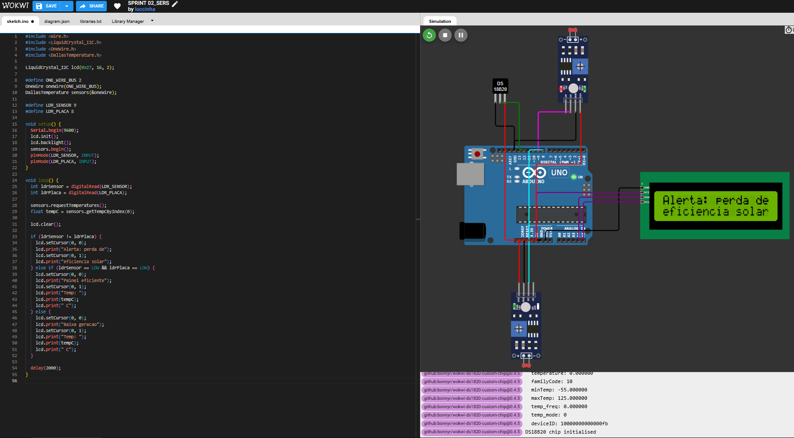

# Sistema de Diagnóstico Inteligente de Painéis Solares ☀️

Este projeto foi desenvolvido como parte da Sprint 2 da disciplina "Soluções em Energias Renováveis e Sustentáveis" (SERS) na FIAP. O objetivo é apresentar um protótipo funcional (simulado) de um sistema de monitoramento inteligente para eficiência de painéis solares, com integração a assistentes virtuais e automação.

---

## 📌 Funcionalidades

- Monitoramento de eficiência solar via sensores de luminosidade e temperatura.
- Exibição de alertas em display LCD simulando mensagens ao usuário.
- Integração com o Google Assistant via IFTTT para comandos de voz e notificações.
- Diagnóstico de perda de eficiência por diferença de luminosidade ou temperatura elevada.

---

## 🧠 Lógica de Funcionamento

O sistema compara a luz captada por dois sensores LDR:
- Um representa a **luz ambiente**.
- Outro simula a **luz recebida diretamente pelo painel**.

Se a diferença for significativa, é identificado um alerta de eficiência.  
Além disso, a **temperatura do painel** é monitorada com um sensor DS18B20 — valores altos (>50 °C) também geram alertas.

As mensagens são exibidas no display LCD I2C.

---

## 🧪 Protótipo Simulado (Wokwi)

🔗 [Acesse o protótipo no Wokwi](https://wokwi.com/projects/433929504230076417)

---

## 🔧 Componentes Utilizados

| Componente | Função |
|-----------|--------|
| LDR x2 | Medem luminosidade da placa e do ambiente |
| DS18B20 | Mede a temperatura local |
| ESP32 (simulado com Arduino Uno) | Microcontrolador com Wi-Fi |
| LCD 16x2 I2C | Exibe mensagens para o usuário |
| IFTTT + Google Assistant | Integração com comandos de voz |

---

## 🎤 Integração com Google Assistant (via IFTTT)

- Applet configurado para escutar o comando:
  > "Ok Google, verificar eficiência dos painéis solares"

- Exemplo de resposta:
  > “Eficiência atual dos painéis: 72%  
  > Geração: 86,4W  
  > Status: Dentro do esperado.”

  

🔗 [Link do Applet no IFTTT](https://ift.tt/C5Ts0mn)

---

## 🌐 Arquitetura da Solução

  

---

## 🚀 Próximos Passos (Protótipo Real)

- Utilização real do ESP32 com sensores físicos (LDR, DS18B20, INA219).
- Envio de dados reais via Wi-Fi para API (Java/Spring Boot).
- Respostas dinâmicas baseadas em banco de dados.
- Automação de cargas com relés e priorização de consumo.

---

## 👨‍💻 Integrantes

- Lucas Alves Antunes Almeida
- Lucas Werpp Franco
- Lucca Rosseto Rezende
- Massayoshi Bando Fogaça e Silva
- Miguel Lima da Silva

---

## 📽️ Vídeo Técnico

🔗 [Link para o vídeo técnico no YouTube (em breve)](https://youtube.com)

